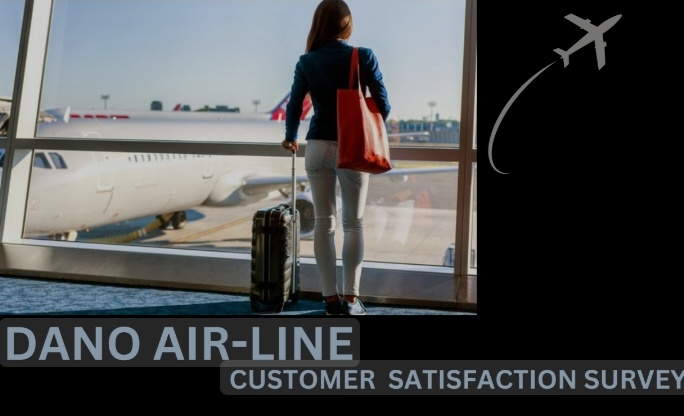
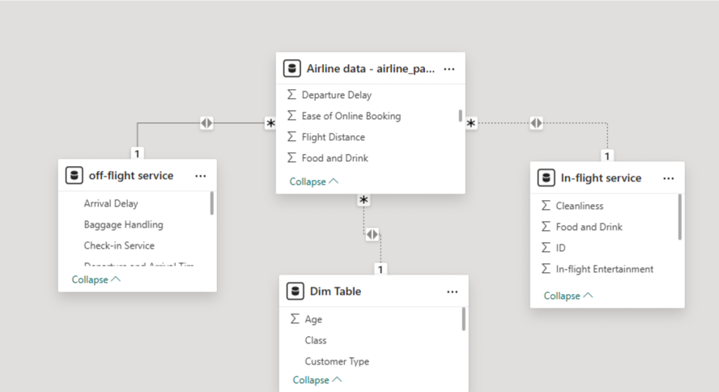
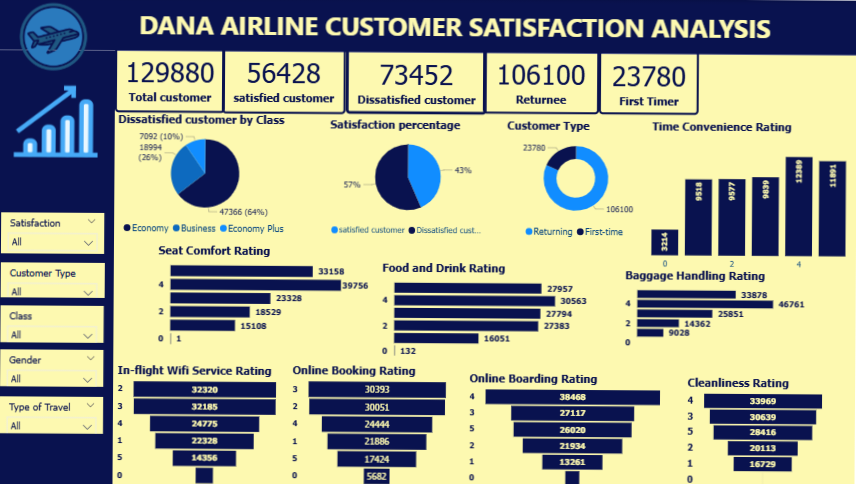

# Dano-Airline-Customer-Satisfaction-Report

Customer Satisfaction Analysis 

## Table of Content 

- Introduction

- Data Overview

- Problem Statement

- Key Metrics 

- Skills Demonstrated

- Visualization

- Analysis

- Data source

- Conclusion and Recommendation
  
## Introduction

Dana Airline is a U.K. based airline headquartered in London, United Kingdom carried out a recent customer's satisfaction survey shows the satisfaction rate dipped below 50% for the first time. One of the major factors for a successful airline business is customer satisfaction, considering the satisfaction rate of Dana Airline falling below 50% of usual rating is a potential threat to the business.
Data from about 130,000 customers of Dana airline were collected to rate the airline performance considering various factors both from new and returning customers. This analysis is to create insights, analyze it and derive a data driven solution for the management to improve customer satisfaction.

## Data Overview
The dataset contain data from 129,880 customers information such as ID, customer type, flight type, reason for boarding and their rating on a 0-5 scale of different factors such as the airline cleanliness, comfort, in-flight service, in-flight wi-fi service, Ease of booking, foods and drinks and other services offer by the airline.

## Problem Statement
The satisfaction rate of customers from the survey carried out is lower than 50% indicating there is something wrong in it’s operation, this analysis is to explore all possible factors and identify factors that are likely to be the cause of the low satisfaction rate and offer possible solution to address the problem.

## Key Metrics

- Total customer

- Number of satisfied customers

- Number of dissatisfied customers

- Number of Returning Customers

- Total First Time Customers

## Skills Demonstrated

- Data gathering

- Data cleaning and transformation

- Data modelling

- Quick measure and DAX expressions

- Data visualization

- Dashboard automation

- Use of power query for data modification

## Visualization

## Analysis

- How many dissatisfied customers rate the time convenience below average:
25,315 of the dissatisfied customers rate the time convenience below average making approximately 34.5% of dissatisfied customers.

- What customer type are most dissatisfied:
The returning customers are the most dissatisfied customers with of 129880 customers.

- How many customers rate the online boarding 3 and below: 
Total number of 65392 customers rate the online boarding as average and below average.

- What flight class have the most percentage among the dissatisfied customer: The Economy class have the most dissatisfied percentage which is 64.5% of the dissatisfied customers.

- Does in-flight wi-fi service affect customer satisfaction: 90,749 customers rate the in-flight wi-fi service to be below and equal average indication dissatisfaction therefore, yes, in-light wi-fi service affect customer satisfaction.

- How many customers rate baggage handling above average (3):
80,639 customer rate the baggage handling above average (3).

- Is food and drink necessarily a factor to consider:
Yes, it should be considered one of the major factors, because 59,485 of 129,880 customers rate the satisfaction below average which is 45.8% of the total customers

- How many customers rate the online boarding below 3:
38,275 customers rate the online boarding below 3.

## Data Source
  https://docs.google.com/spreadsheets/d/15Kp-2yfQFNRGJPNOkpMwG-OMX8xVZOJ5VL7f35v7sRQ/edit#gid=1647986900

## Conclusion and Recommendation

From the insights drawn and analysis done, customers are quite satisfied with factors like cleanliness, on-board service, check-in service, in-flight service and baggage handling. However, considering the low ratings of other factors and the number of dissatisfied returning customers indicate some factors like the in-flight wi-fi service, time convenience, in-flight boarding service as well as food and drinks are most likely to the major reasons for low customer satisfaction percentage that dropped below 50%.
I therefore recommend:

- A strong wi-fi connection should be put in place with reduction in price for customers that might need internet access above the airline budget.

- The arrival and departure time should be adjusted to customers convenience as well as food and drinks serve should be adjust in taste, quantity and in varieties for customers to choose.
